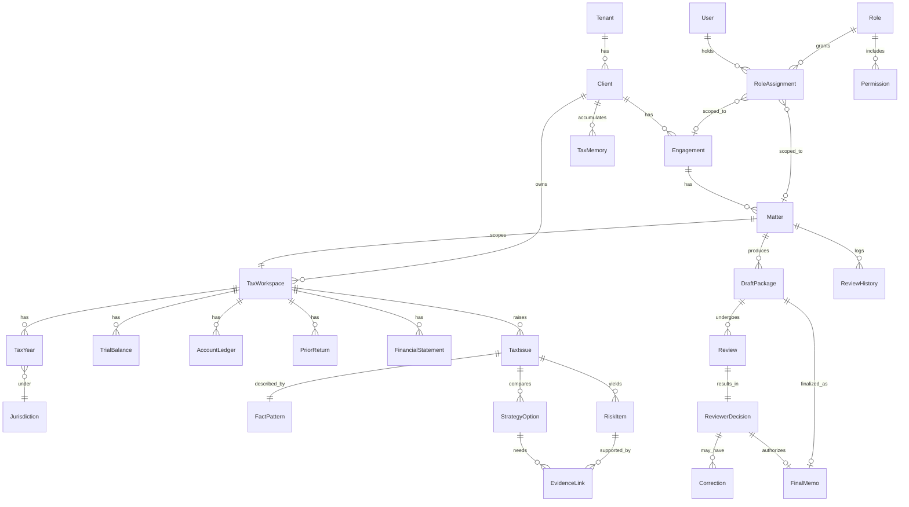
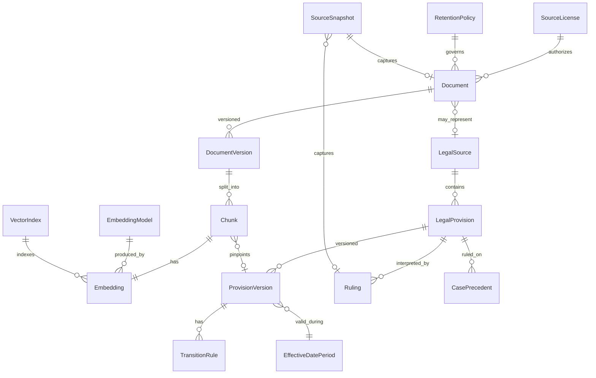
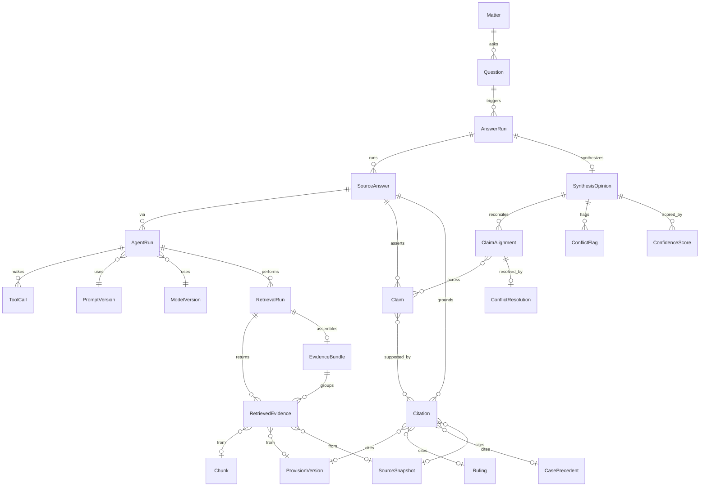
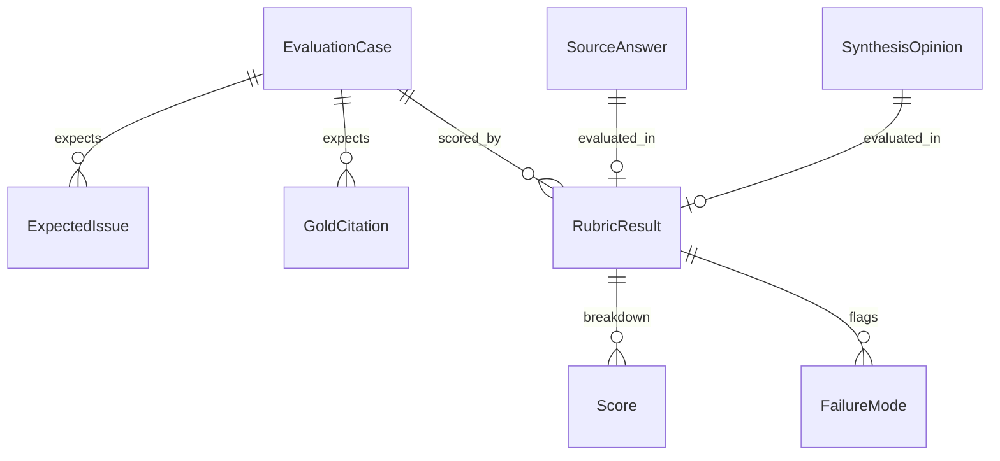

# 章 04 — ERD · 데이터 모델 (Provenance 중심)

> **왜 01·02 다음인가**: 테넌트 격리키(`01`)와 출처·시점 모델(`02`)이 스키마의 *전제*다. 그래서 ERD는 이 둘을 반영해 작성한다.
> **3대 불변식(invariant)**:
> 1. **격리키 전파** — 모든 고객 파생 레코드는 `client_id`(+필요 시 `matter_id`)를 가진다(NULL 금지).
> 2. **인용은 버전 객체를 가리킨다** — `Citation` → `ProvisionVersion`/`Ruling`/`CasePrecedent`/`SourceSnapshot`(raw URL/문자열 ✕).
> 3. **시점 유효성** — 법적 결론은 `applicable_basis`(거래일/귀속/사업연도/신고/처분/경정청구일)를 통해 실제 날짜 사실에 연결되고, 법령은 시행일 버전으로 선택된다.

---

## 1. 도메인 클러스터 개요

| 클러스터 | 엔티티 | 코드 위치(Workpaper 2120) |
|---|---|---|
| A. 테넌시·신원 | Tenant·Client·Engagement·Matter·User·Role·RoleAssignment·Permission·AuditLog | `contract/`(스키마)·`src/`(권한평가) |
| B. 세무 워크스페이스·대상 | TaxWorkspace·TaxYear·Jurisdiction·TrialBalance·AccountLedger·PriorReturn·FinancialStatement | `contract/`·`src/` |
| C. 문서·RAG | Document·DocumentVersion·Chunk·Embedding·EmbeddingModel·VectorIndex·SourceLicense·RetentionPolicy | 스키마 `contract/`·데이터 런타임 |
| D. 법령 출처·provenance | LegalSource·LegalProvision·ProvisionVersion·TransitionRule·EffectiveDatePeriod·Ruling·CasePrecedent·SourceSnapshot | `contract/`(공유 참조) |
| E. 세무 분석 | TaxIssue·FactPattern·RiskItem·StrategyOption·EvidenceLink | `contract/`·`rules/` |
| F. 질의·독립답변·종합 | Question·AnswerRun·RetrievalRun·RetrievedEvidence·EvidenceBundle·**SourceAnswer·Claim·SynthesisOpinion·ClaimAlignment·ConflictResolution**·Citation·ConflictFlag·ConfidenceScore | `contract/`·`src/` |
| G. 에이전트·실행 | AnswerRun(오케스트레이션)·AgentRun·PromptVersion·ModelVersion·ToolCall | `prompts/`·`src/ai/` |
| H. 검토·HITL·산출 | DraftPackage·Review·ReviewerDecision·Correction·FinalMemo·ReviewHistory·TaxMemory | `src/`·`skills/` |
| I. 평가 | EvaluationCase·ExpectedIssue·GoldCitation·Score·RubricResult·FailureMode | `tests/golden/` |

---

## 2. ERD — A·B·E·H (테넌시 → 분석 → 검토)

- **격리**: `Client`가 최상위 격리 소유. `TaxWorkspace`·`TaxIssue`·`DraftPackage` 등은 `client_id`(+`matter_id`) 전파.
- **권한**: `User`는 `RoleAssignment`(Matter/Engagement 범위)로만 접근. 전역 Role ✕(`SEC-012`). **scope 규약(Codex)**: `RoleAssignment`는 `scope_type`(MATTER|ENGAGEMENT) + `scope_id` 로 **정확히 하나의 범위**에 묶인다(둘 다 필수 ✕ — 위 다이어그램의 두 관계는 *택일*).
- **분석 체인**: `TaxIssue → (RiskItem | StrategyOption) → EvidenceLink`. 선택지별 비교표(`OUT-`)는 `StrategyOption` 집합에서 생성.

---

## 3. ERD — C·D (문서/RAG ↔ provenance)

### 3-1. 핵심 속성 (C·D 발췌)

**`Chunk`**: `chunk_id` · `document_version_id` · `chunk_text` · `chunk_type`(법령/예규/판례/메모/실무서/계약/재무) · `source_locator`(조·항·호·목/page/paragraph) · `법령명|문서번호|사건번호` · `effective_from/to` · `tax_type` · `귀속연도` · `client_id`(고객자료) · `confidentiality_level` · `license_id` · `embedding_id` · `content_hash`.

**`Embedding`**: `embedding_id` · `chunk_id` · `model_name`(→`EmbeddingModel`) · `dimension` · `vector` · `index_id`(→`VectorIndex`) · `embedded_at`. *(벡터 데이터 자체는 런타임 스토리지, 스키마만 contract)*

**`VectorIndex`**: `index_id` · `scope`(SHARED 읽기전용 / TENANT) · `client_id`(TENANT일 때) · `embedding_model` · `version`. → **SHARED ⟂ TENANT 물리 분리**(`SEC-003`, `RAG-007`).

**`ProvisionVersion`**: `provision_version_id` · `provision_id` · `text` · `promulgated_date`(공포일) · `effective_from`(inclusive) · `effective_to`(exclusive) · `amended_by`(개정 법률·문서번호) · `amendment_reason` · `snapshot_id` · `hash`.

**`TransitionRule`**: `rule_id` · `provision_version_id` · `applies_when`(사업연도 개시/종료일·거래일 조건식) · `rule_text` · `machine_condition`(기계 판정식).

**`SourceSnapshot`**: `snapshot_id` · `url` · `canonical_title` · `publisher` · `published_date` · `effective_date?` · `retrieved_at` · `extraction_method`(HTML/PDF/HWP/OCR) · `content_hash` · `official`.

---

## 4. ERD — F·G (질의 → **3소스 독립답변** → **종합의견**)

> **모델 변경(50/30/20 가중 폐기 → 독립답변+종합)**: 한 질의(`AnswerRun`)는 **소스별 완결 답변(`SourceAnswer`, 최대 3개: LAW_MCP/INTERNAL_RAG/WEB)** 을 만들고, **종합의견(`SynthesisOpinion`)** 이 claim 단위로 정합한다. **종합은 직접 인용하지 않고 source의 인용을 상속**한다(Big4: *독립 출처 삼각검증 + claim 단위 정합*).

### 4-1. 핵심 속성 (F 발췌)

**`AnswerRun`**: `answer_run_id` · `question_id` · `client_id` · `policy_version`(충돌해소·전송정책 버전) · `retrieval_config` · `risk_tier`(triage 결과) · `sources_planned[]`. → 질의 1건의 오케스트레이션(이전 `OrchestrationRun` 개념 흡수).

**`SourceAnswer`**: `source_answer_id` · `answer_run_id` · **`source_type`(LAW_MCP|INTERNAL_RAG|WEB — 정확히 하나)** · `status`(ANSWERED|SILENT|ERROR|BLOCKED) · `answer_text` · `version`(불변) · `retrieval_run_id` · `client_id`. → 각 소스가 **자기 채널만으로** 완결 답변.

**`Claim`**: `claim_id` · `source_answer_id` · `proposition`(원자 명제) · `claim_span` · `citation_ids[]`(지지 인용). → 종합·정합의 단위.

**`SynthesisOpinion`**: `synthesis_id` · `answer_run_id` · `source_answer_ids[]`(불변 버전 참조) · `policy_version` · `opinion_text` · `abstained`(bool) · `authority_deficit`(①법령 부재 등) · `confidence_cap`. → **새 인용 생성 ✕**, source claim 상속.

**`ClaimAlignment`**: `alignment_id` · `synthesis_id` · `claim_ids[]`(소스 간 대응 claim) · `status`(AGREE|CONFLICT|SILENT) · `resolution_id?`.

**`ConflictResolution`**: `resolution_id` · `inputs`(authority_rank·temporal_validity·fact_match·source_type) · `rule_applied` · `outcome`(권위우선|시점우선|사실불일치배제|미해소→abstain) · `logged_at`. → `08 §5-1` 결정테이블 결과(재현·감사).

**`RetrievalRun`**: `run_id` · `source_answer_id` · `subqueries[]` · `filters`(tenant_scope·tax_type·시점·doc_type·authority) · `candidate_chunk_ids[]` · `rerank_scores[]` · `selected_chunk_ids[]` · `client_id`. → 재현성(`SEC-007`, `RAG-013`).

**`Citation`**: `citation_id` · **`source_answer_id`**(종합이 아니라 소스답변 소속) · `claim_span` · `source_kind`(ProvisionVersion/Ruling/Case/Snapshot) · `source_object_id` · `source_locator`(pinpoint) · `quote` · **`applicable_basis`**(basis_kind + `TaxYear`/`Matter`/`FactPattern` 날짜 사실) · `support_type`(직접/유추/반대) · `authority_rank` · `confidence`.

**`ConflictFlag`**: `flag_id` · `synthesis_id` · `claim_alignment_id` · `sources[]` · `description` · `escalated_to_review`(bool).

**`ConfidenceScore`**: `target_kind`(SOURCE_ANSWER|SYNTHESIS) · `target_id` · `retrieval_confidence` · `generation_confidence`(**분리**, `HALU-006`) · `abstained`(bool) · `reason`. → 소스답변·종합의견 **각각** 채점.

---

## 5. ERD — I (평가 / Ralph loop 하버스)

- `EvaluationCase`: `case_id` · `visibility`(HIDDEN/PUBLIC) · `adversarial`(bool) · `ensemble_kind?`(SILENT/2v1/3way/LAW_ABSENT) · `fact_pattern` · `applicable_basis` · `expected_abstain?`.
- `GoldCitation`: 기대 인용(소스객체·pinpoint). → recall@k·entailment 채점(`09`).
- `RubricResult`: `case_id` · `target_kind`(SOURCE_ANSWER|SYNTHESIS) · `target_id` · `hard_gate_hit?` · `cap` · `dimension_scores` · `total`. → **소스답변·종합의견 따로 채점**(`EVAL-002`).

---

## 6. 횡단 불변식 · 인덱스 · 키 규칙

- **격리키**: `client_id`는 A·B·C(고객자료)·F·H 전 레코드에 NOT NULL. SHARED 참조지식(D 일부·실무서)은 `client_id` 없음(공유). → 쿼리는 `(client_id = ? OR scope = SHARED)` 만 허용, **그 외 조합 불가**.
- **시점 인덱스**: `ProvisionVersion(provision_id, effective_from, effective_to)` 복합 인덱스 → as-of 조회.
- **인용 무결성 + XOR(Codex)**: `Citation`은 `(source_kind, source_object_id)` 로 **정확히 하나의 버전 소스객체를 참조**(NULL 금지·XOR 강제). 존재 검증=`HALU-003`. → "근거 없는 인용"이 구조적으로 불가(provenance escape 차단).
- **증거 정규화(Codex)**: `RetrievedEvidence`는 `Chunk` | `ProvisionVersion` | `SourceSnapshot` 중 **정확히 하나**의 출처를 가리킨다(웹/법령MCP 직접 evidence가 Chunk 정규화 전이어도 출처 객체에 묶임). orphan evidence 금지.
- **HITL 선행(Codex)**: `FinalMemo`는 `ReviewerDecision`(승인)이 **선행**해야 생성(H5). 미승인 FinalMemo 금지.
- **독립답변→종합 불변식(Codex)**:
  - `SourceAnswer`는 **정확히 하나**의 `source_type`(LAW_MCP|INTERNAL_RAG|WEB)만 사용한다.
  - `SynthesisOpinion`은 **불변 버전의 `SourceAnswer`** 를 참조하고, **직접 인용을 만들지 않는다**(source의 `Citation` 상속).
  - **표시되는 모든 종합 claim은 인용된 source claim으로 추적**돼야 한다(미추적 → 표시 차단, `HALU-014`).
  - **충돌은 claim 단위**(`ClaimAlignment`)로 저장(답변 단위만 ✕).
  - **인용 날조가 한 `SourceAnswer`에 있으면 그 소스 60 캡 + 종합에 경고 전파**(`HALU-013`).
  - **교차 테넌트 누수는 `AnswerRun` 전체를 무효화**(부분 사용 금지).
- **완결 run 불변식(Codex 최종 — 감사 추적의 핵심)**:
  - ① `COUNT(SourceAnswer per AnswerRun) BETWEEN 1 AND 3` 이고 run 내 `source_type` 는 **유일**(같은 채널 중복 ✕). *(mermaid는 max=3을 못 그리므로 제약으로 명시.)*
  - ② **완결된 `AnswerRun`은 `SynthesisOpinion`을 정확히 1개** 가진다(`abstained=true`(보류)여도 1개 — "보류"도 결론의 한 형태).
  - ③ `ClaimAlignment.status=CONFLICT` 이면 **`ConflictResolution`(결정적 outcome)** 또는 `SynthesisOpinion.abstained`/escalation 중 하나가 반드시 존재(미해소 충돌을 그냥 둘 수 없음).
  - ④ **표시되는 모든 source claim은 ≥1 유효 `Citation`** 을 가진다(단 `status=SILENT` claim 제외).
- **재현성 키**: `SynthesisOpinion` → (`SourceAnswer[]`(불변), `policy_version`, `ConflictResolution[]`) + 각 `SourceAnswer` → (`RetrievalRun`, `PromptVersion`, `ModelVersion`, `ToolCall[]`, `Citation[]→source hash`) 전부 보존.
- **감사**: `AuditLog(actor, action, target_type, target_id, client_id, ts)` append-only·변조방지(`SEC-017`).

---

## 7. 면접 한 줄

> "이 데이터 모델의 핵심은 두 가지입니다. **인용이 URL이 아니라 '시행일이 박힌 조문 객체'를 가리킨다**는 것, 그리고 **모든 고객 레코드가 격리키를 달고 다닌다**는 것. 그래서 '이 답이 어느 시점 어느 조문으로 나왔는지' 재현되고, A사 자료가 B사 검색에 절대 섞이지 않습니다."
